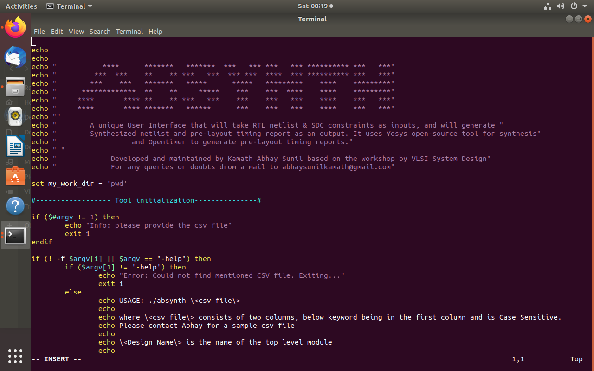
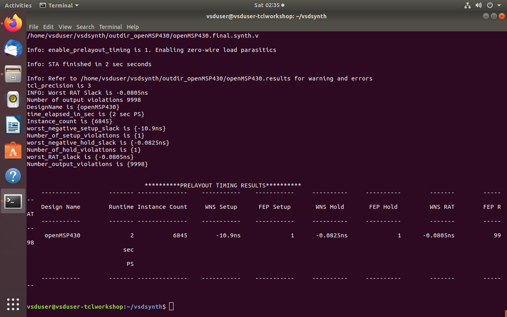

# ASIC Synthesis & STA Automation (Yosys + OpenTimer)

This project automates the ASIC front-end flow from reading configuration files to generating timing analysis reports.  
It uses Tcl with Yosys for synthesis and OpenTimer for static timing analysis (STA).

## Overview

The script:
1. Reads design and file path settings from a configuration CSV.
2. Reads timing constraints from another CSV.
3. Validates all required directories and files.
4. Generates a Synopsys Design Constraints (SDC) file.
5. Checks design hierarchy for missing modules.
6. Runs logic synthesis with Yosys.
7. Cleans the synthesized netlist.
8. Runs STA with OpenTimer.
9. Reports slack, violations, instance count, and runtime.



*Figure 1: Script running in the terminal with initial tool setup.*



*Figure 2: Output showing pre-layout timing results from OpenTimer.*
---

## Project Structure

```

.
├── script.tcl                 # Main automation script
├── config.csv                 # Design and file path settings
├── constraints.csv            # Clock, input, and output timing constraints
├── netlist/                   # RTL/netlist Verilog files
├── libs/                      # Liberty timing libraries
├── output/                    # Generated files and reports

````

---

## Input Files

### 1. config.csv

Example:

| DesignName | OutputDirectory | NetlistDirectory | EarlyTimingLibrary | LateTimingLibrary | ConstraintsFile |
|------------|-----------------|------------------|--------------------|-------------------|-----------------|
| mychip     | ./output        | ./netlist        | ./libs/early.lib   | ./libs/late.lib   | ./constraints.csv |

**Tcl snippet reading `config.csv`:**
```tcl
package require csv
set fp [open $argv r]
set data [csv::read2matrix $fp m]
close $fp
set designName [m get cell 1 0]
set outputDir  [m get cell 1 1]
````

---

### 2. constraints.csv

Example:

| type   | name    | period | waveform\_rise | waveform\_fall | early\_rise\_delay | early\_fall\_delay | late\_rise\_delay | late\_fall\_delay |
| ------ | ------- | ------ | -------------- | -------------- | ------------------ | ------------------ | ----------------- | ----------------- |
| CLOCK  | clk     | 5.0    | 0.0            | 2.5            |                    |                    |                   |                   |
| INPUT  | data\_i |        |                |                | 0.5                | 0.5                | 1.0               | 1.0               |
| OUTPUT | data\_o |        |                |                |                    |                    | 0.7               | 0.7               |

**Tcl snippet generating SDC:**

```tcl
if {$type eq "CLOCK"} {
    puts $sdc "create_clock -name $name -period $period -waveform {$waveform_rise $waveform_fall} \[get_ports $name]"
} elseif {$type eq "INPUT"} {
    puts $sdc "set_input_delay -min $early_rise_delay -clock $clock \[get_ports $name]"
}
```

---

## How to Run

```bash
tclsh script.tcl config.csv
```

The script will:

* Validate all inputs
* Generate `<DesignName>.sdc`
* Create and run Yosys synthesis scripts
* Run OpenTimer for STA
* Produce reports in the output directory

---

## Main Steps with Code Examples

### 1. Validate Inputs

```tcl
if {![file exists $outputDir]} {
    error "Output directory does not exist: $outputDir"
}
```

### 2. Run Yosys Hierarchy Check

```tcl
puts $ys "read_verilog $netlistDir/*.v"
puts $ys "hierarchy -check -top $designName"
```

### 3. Run Yosys Synthesis

```tcl
puts $ys "synth -top $designName"
puts $ys "write_verilog $outputDir/$designName.synth.v"
exec yosys -s $outputDir/$designName.synth.ys
```

### 4. Clean Synthesized Netlist

```tcl
set in [open "$outputDir/$designName.synth.v" r]
set out [open "$outputDir/$designName.final.synth.v" w]
while {[gets $in line] >= 0} {
    if {![regexp {^\s*\/\/} $line]} {puts $out $line}
}
```

### 5. Run OpenTimer STA

```tcl
puts $ot "read_celllib $earlyLib -min"
puts $ot "read_celllib $lateLib  -max"
puts $ot "read_verilog $outputDir/$designName.final.synth.v"
puts $ot "read_sdc $outputDir/$designName.sdc"
puts $ot "report_timing > $outputDir/$designName.results"
exec ./opentimer $outputDir/$designName.conf
```

---

## Output Files

Inside the output directory:

| File                         | Description                                |
| ---------------------------- | ------------------------------------------ |
| `<DesignName>.sdc`           | Generated Synopsys Design Constraints file |
| `<DesignName>.hier.ys`       | Yosys hierarchy check script               |
| `<DesignName>.synthesis.log` | Yosys synthesis log                        |
| `<DesignName>.final.synth.v` | Clean synthesized netlist                  |
| `<DesignName>.conf`          | OpenTimer configuration file               |
| `<DesignName>.results`       | STA results                                |
| `<DesignName>.summary`       | Slack, violations, instance count, runtime |

---

## Dependencies

* Tcl with packages:

  * csv
  * struct::matrix
* Yosys (logic synthesis)
* OpenTimer (static timing analysis)

Install example (Ubuntu):

```bash
sudo apt install tcllib yosys
# Build OpenTimer from source:
git clone https://github.com/OpenTimer/OpenTimer.git
cd OpenTimer && make
```

---

## Workflow Diagram

```
  config.csv + constraints.csv + netlist + libs
         │
         ▼
   [Validate Inputs]
         │
         ▼
   [Generate SDC]
         │
         ▼
  [Yosys Hierarchy Check]
         │
         ▼
   [Yosys Synthesis]
         │
         ▼
 [Clean Synthesized Netlist]
         │
         ▼
  [OpenTimer STA Analysis]
         │
         ▼
  summary.log + reports
```

